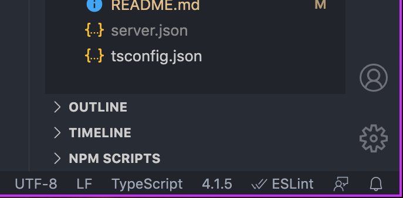
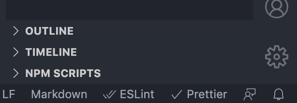
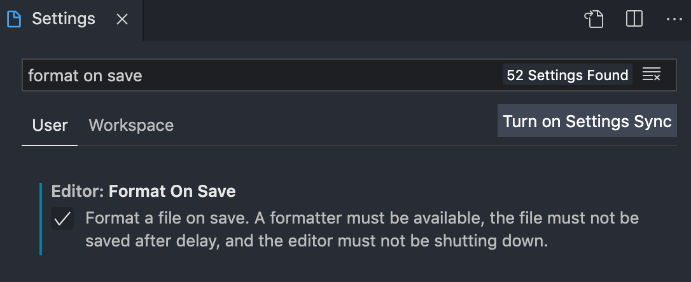

# Nira-chan

A Discord bot for ZUTOMAYO ZONE!

## Commands and Capabilities

Although Nira has been designed with ZUTOMAYO ZONE in mind, recent developments have led to the bot beginning to be able to perform general purpose tasks globally.

- Most notably, when inviting Nira to other servers, and you'll be able to use external emotes from them via `<prefix>emotename` or `:emotename:`!
- Non-Nitro users will be also able to use animated emotes this way.

## Getting Started

### Prerequisites

- nodeJS (v12.0 or higher)
- [Discord Bot Application](https://discord.com/developers/applications)

### Installation & Usage

1. Clone or download the repository

   ```sh
   $ git clone https://github.com/anomalilies/Nira-chan.git
   ```

2. Install npm packages

   ```sh
   $ npm install
   ```

3. Adjust the config file in `src/config/config.json` to your needs (more information in the section down below)

4. Create a `.env` file in the root directory `/` and set all environment variables you find in `.env.example`

5. Run the discord bot

   ```
   $ npm start
   ```

### Configuration

All the server specific data are configured under `src/config/config.json`. You will find Roles, Emotes, Users, Channels and more. This config file is used in production and should not be modified. How do I work with my own server then?

1. Make a copy of `config.json` and name it `development.json`

2. Adjust everything you need to fit your server

3. After you are done developing and you have changes in `config.json` (added/removed/changed configs), copy the content into `development.json`

4. Revert all the changes that are specific to your server in `config.json`

5. Commit `config.json` with all the other changes you did

6. Copy the contents of `development.json` into `config.json` and you can start developing again

#### Notes

- Please do NOT commit your custom `config.json` file!
- If you've messed up, you should still have `development.json`
- If you've REALLY messed up, copy `config_backup.json` and start over from scratch
- If you've changed `config.json`, update `config_backup.json`
- It is recommended to use a different prefix to avoid collisions and set yourself as `currentOwner`

#### How Do I Get My Server Specific Configuration

The tedious way is to find what you are looking for and copying the IDs manually. This searching takes a long time because there are a lot of configs to setup, like emojis for example.

The easy way is to simply start the bot in development and execute the command `ids` in `src/commands/moderation/ids.ts`. This command will create a `server.json` file in the root directory `/`. It contains ALL

- Channel IDs
- Role IDs
- Emote IDs

with their respective name. This file is not under version control and the command can only be executed in development!

### Nodemon

> Nodemon is a utility depended on by over 1.5 million projects, that will monitor for any changes in your source and automatically restart your server. Perfect for development.

We use this tool to make the development process smoother. You can customize it by editing the `nodemon.json` file.

## Testing Local Nira-chan On The Zutomayo Discord Server

In order to avoid conflicts between the two, you should:

1. Change your local prefix

2. Disable all event handlers in `src/config/event_handler.json` (set the values to `false`)

If you want to test an event handler, you should turn it off on the deployed Nira-chan and turn it on for your local instance. You need to have the `Nira Developer` or `Moderation` role to toggle event handlers.

```
# Turn on/off event handler (discord command)
-toggle <event handler name>

# List all event handlers (discord command)
-list

# Modify `event_handler.json` to make permanent changes
# Server restarts will always load this file first
```

## VSCode Configuration

This section will guide you to setup VSCode for developing.

### Plugins

#### Required

- [ESLint](https://marketplace.visualstudio.com/items?itemName=dbaeumer.vscode-eslint)
- [Prettier](https://marketplace.visualstudio.com/items?itemName=esbenp.prettier-vscode)

#### Recommended

- [Better Comments](https://marketplace.visualstudio.com/items?itemName=aaron-bond.better-comments)
- [Bracket Pair Colorizer 2](https://marketplace.visualstudio.com/items?itemName=CoenraadS.bracket-pair-colorizer-2)
- [Color Highlight](https://marketplace.visualstudio.com/items?itemName=naumovs.color-highlight)
- [Material Icon Theme](https://marketplace.visualstudio.com/items?itemName=PKief.material-icon-theme)
- [One Dark Pro](https://marketplace.visualstudio.com/items?itemName=zhuangtongfa.Material-theme)
- [GitLens - Git supercharged](https://marketplace.visualstudio.com/items?itemName=eamodio.gitlens)
- [Visual Studio IntelliCode](https://marketplace.visualstudio.com/items?itemName=VisualStudioExptTeam.vscodeintellicode)

### ESLint

> ESLint is a tool for identifying and reporting on patterns found in ECMAScript/JavaScript code, with the goal of making code more consistent and avoiding bugs.

After installing the ESLint extension you should see a double check mark next to `ESLint` in the bottom right corner of VSCode. The plugin will load the configuration from `.eslintrc`. If you have troubles, click on `ESLint` to open the output console for more information.



### Prettier

> Prettier is an opinionated code formatter. It removes all original styling and ensures that all outputted code conforms to a consistent style. Prettier takes your code and reprints it from scratch by taking the line length into account.

After installing the Prettier extension you should see it in the bottorm right corner of VSCode. The plugin will load the configuration from `.prettierrc`. You need to activate it now by formatting your code. It should have a check mark now if it works.

```
Ctrl + Shift + P > "Format Document"
```



#### Format on Save

It is highly recommended to turn this feature on in VSCode. It will automatically format your code with Prettier by just saving the file. It will save you time and energy.

1. Open Settings

   ```
   Ctrl + ,
   ```

   or

   ```
   Ctrl + Shift + P > "Preferences: Open Settings (UI)"
   ```

2. Search for `Format On Save`

3. Tick the checkbox for `Editor: Format On Save`



## Technologies

W.I.P.

List all used technologies in this section. (it is a great reference for your portfolio)

## License

Distributed under the ISC License. See `LICENSE` for more information.

## Contributors

W.I.P.

Use this tool to automate this task: https://allcontributors.org/docs/en/bot/overview
